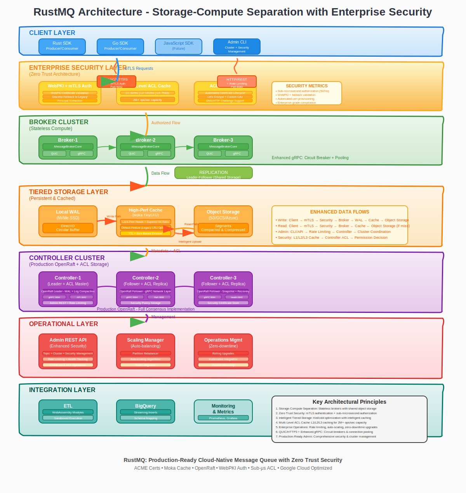

# RustMQ: Cloud-Native Distributed Message Queue System

[](https://github.com/cloudymoma/rustmq/actions)
[](LICENSE)
[](https://www.rust-lang.org)
[](https://github.com/cloudymoma/rustmq)

RustMQ is a next-generation, cloud-native distributed message queue system that combines the high-performance characteristics of Apache Kafka with the cost-effectiveness and operational simplicity of modern cloud architectures. Built from the ground up in Rust, RustMQ leverages a shared-storage architecture that decouples compute from storage, enabling unprecedented elasticity, cost savings, and operational efficiency.

**Optimized for Google Cloud Platform**: RustMQ is designed with Google Cloud services as the default target, leveraging Google Cloud Storage for cost-effective object storage and Google Kubernetes Engine for orchestration, with all configurations defaulting to the `us-central1` region for optimal performance and cost efficiency.

## 🚀 Quick Start

### Development Cluster (Single Zone)
```bash
# Build images locally
cd docker/ && ./quick-deploy.sh dev-build

# Deploy development cluster  
cd ../gke/ && ./deploy-rustmq-gke.sh deploy --environment development
```

### Production Cluster (Single Zone)
```bash
# Build and push production images
cd docker/ && PROJECT_ID=your-project ./quick-deploy.sh production-images

# Deploy production cluster
cd ../gke/ && PROJECT_ID=your-project ./deploy-rustmq-gke.sh deploy --environment production
```

For detailed setup, see [GKE Deployment Guide](docs/gke-deployment-guide.md).

## 🚀 Key Features

- **10x Cost Reduction**: 90% storage cost savings through single-copy storage in Google Cloud Storage
- **100x Elasticity**: Instant scaling with stateless brokers and metadata-only operations  
- **Single-Digit Millisecond Latency**: Optimized write path with local NVMe WAL and [zero-copy data movement](docs/zero-copy-optimization.md)
- **Sub-Microsecond Security**: Enterprise-grade security with 547ns authorization decisions and 2M+ ops/sec
- **QUIC/HTTP3 Protocol**: Reduced connection overhead and head-of-line blocking elimination
- **WebAssembly ETL**: Real-time data processing with secure sandboxing and smart filtering
- **Auto-Scaling & Auto-Rebalancing**: EWMA-weighted load scoring with continuous partition redistribution
- **Consumer Groups**: Kafka-compatible consumer group protocol with WAL-backed offset persistence, snapshot recovery, and coordinator discovery
- **Broker Metrics**: Prometheus metrics with per-broker CPU/memory/disk/network monitoring and heartbeat-based controller reporting
- **Google Cloud Native**: Default configurations optimized for GCP services 


## 🏗️ Architecture Overview

RustMQ implements a **storage-compute separation architecture** with stateless brokers and shared cloud storage for unprecedented elasticity and cost efficiency.



*Click to view the interactive architecture diagram showing RustMQ's innovative storage-compute separation design*

### Key Architectural Principles

1. **Storage-Compute Separation**: Brokers are stateless; all persistent data in shared object storage
2. **Intelligent Tiered Storage**: Recent data is served from an in-memory hot tier; cold data lives in object storage. The local WAL is **durability/recovery-only** — consumer reads are never served from it (AutoMQ-style separation, keeping RustMQ's sub-ms local-WAL write latency)
3. **Replication Without Data Movement**: Shared storage enables instant failover
4. **QUIC/HTTP3 Protocol**: Modern transport for reduced latency and head-of-line blocking elimination
5. **Raft Consensus**: Distributed coordination for metadata and cluster management
6. **Auto-scaling & Operations**: Cloud-native operational capabilities with Kubernetes integration

### Architecture Layers

The diagram above illustrates RustMQ's enhanced layered architecture with enterprise security:

- **🔵 Client Layer** - Client SDKs (Rust, Go) with mTLS support and admin CLI for security and cluster management
- **🟡 Enterprise Security Layer** - Zero Trust architecture with mTLS authentication, multi-level ACL cache (547ns/1310ns/754ns), certificate management, and 2M+ ops/sec authorization capacity
- **🟢 Broker Cluster** - Stateless compute nodes with MessageBrokerCore, enhanced QUIC/gRPC servers featuring circuit breaker patterns, connection pooling, and real-time health monitoring
- **🟠 Tiered Storage** - Durability-only segmented WAL (append + sequential recovery; O_DIRECT active segment), a memory-bounded in-memory hot serving tier (byte budget + append backpressure), background tiering with small-object compaction, a durable broker-local cold index for restart/failover, and object storage with bandwidth limiting + object-level epoch fencing (split-brain safety)
- **🟣 Controller Cluster** - Raft consensus with distributed ACL storage, metadata management, cluster coordination, and comprehensive admin REST API with advanced rate limiting
- **🔴 Operational Layer** - Cluster operations with rolling upgrades, automated scaling with partition rebalancing, consumer group coordination, and Kubernetes integration with volume recovery
- **🟦 Integration Layer** - WebAssembly ETL processing with sandboxing, BigQuery streaming with schema mapping, and comprehensive monitoring infrastructure

### Data Flow Patterns

#### Core Message Flows
- **Write Path**: `Client → QUIC → Broker → WAL (durability) + in-memory hot tier`; background tiering seals/uploads sealed segments `→ Object Storage`
- **Read Path**: `Client ← QUIC ← Broker ← in-memory hot tier` (un-tiered offsets) `← Object Storage` (cold) — **never from the WAL**
- **Replication**: `Leader → Followers (Metadata Only)` - no data movement due to shared storage

#### Security & Authentication Flows
- **Client Authentication**: `Client → mTLS/QUIC → Broker → Certificate Validation → Principal Extraction`
- **Authorization**: `Broker → Multi-Level Cache (L1/L2/L3) → Controller ACL → Permission Decision`
- **Inter-Service**: `Broker ←mTLS/gRPC→ Controller ←mTLS/Raft→ Controller (Cluster)`

#### Administrative & Operational Flows
- **Admin Operations**: `Admin CLI/API → Controller → Cluster Coordination → Broker Updates`
- **Health Monitoring**: `Background Tasks → Broker Health → Admin API → Real-time Status`
- **Scaling Operations**: `Controller → Partition Rebalancing → Broker Addition/Removal → Traffic Migration`

## 📋 Table of Contents

- [🚀 Quick Start](#-quick-start)
- [🏗️ Architecture Overview](#-architecture-overview)
- [📖 Documentation Hub](./docs/README.md)
  - [🛡️ Security Guide](./docs/security/guide.md)
  - [☁️ GKE Deployment](./docs/deployment/gke.md)
  - [🛠️ Admin API](./docs/admin-api.md)
  - [📦 Client SDKs](./docs/client-sdks.md)
  - [📊 BigQuery Integration](./docs/subscribers/bigquery.md)
  - [🧠 WebAssembly ETL](./docs/wasm-etl.md)
  - [⚙️ Configuration Reference](./docs/configuration-guide.md)
- [🔧 Development & Troubleshooting](./docs/development.md)
- [🤝 Contributing](#-contributing)
- [📄 License](#-license)

## 🔧 Development & Production Setup

### Prerequisites

- **Rust 1.88+ and Cargo** - Core development environment
- **Docker and Docker Compose** - Container orchestration (see [docker/README.md](docker/README.md))
- **Google Cloud SDK** - For BigQuery integration and GCP services
- **kubectl** - For Kubernetes deployment (see [docker/README.md](docker/README.md))

### Production Setup

#### Option 1: Docker Environment (Recommended)
```bash
# Clone the repository
git clone https://github.com/cloudymoma/rustmq.git
cd rustmq

# Start complete RustMQ cluster with all services
cd docker && docker-compose up -d

# Verify cluster health
curl http://localhost:9642/health

# Access services:
# - Broker QUIC: localhost:9092 (mTLS enabled)
# - Admin REST API: localhost:9642 (rate limiting enabled)
# - Controller: localhost:9094 (Raft consensus)
```

#### Option 2: Local Build & Run
```bash
# Build all production binaries
cargo build --release

# Verify all tests pass (522+ tests in debug, 531+ in release)
cargo test --release

# Start controller cluster (Raft consensus + ACL storage)
./target/release/rustmq-controller --config config/controller.toml &

# Start broker with security enabled
./target/release/rustmq-broker --config config/broker.toml &

# Initialize security infrastructure
./target/release/rustmq-admin ca init --cn "RustMQ Root CA" --org "MyOrg"
./target/release/rustmq-admin certs issue --principal "broker-01" --role broker

# Start Admin REST API with rate limiting
./target/release/rustmq-admin serve-api 8080
```

### Basic Operations

#### Topic Management
```bash
# Create topic with replication
./target/release/rustmq-admin create-topic user-events 12 3

# List all topics with details
./target/release/rustmq-admin list-topics

# Get comprehensive topic information
./target/release/rustmq-admin describe-topic user-events

# Check cluster health
./target/release/rustmq-admin cluster-health
```

#### Security Operations
```bash
# Certificate management
./target/release/rustmq-admin certs list --role broker
./target/release/rustmq-admin certs validate --cert-file /path/to/cert.pem

# ACL management
./target/release/rustmq-admin acl create \
  --principal "app@company.com" \
  --resource "topic.events.*" \
  --permissions read,write \
  --effect allow

# Security monitoring
./target/release/rustmq-admin security status
./target/release/rustmq-admin audit logs --since "2024-01-01T00:00:00Z"
```

### Client SDK Usage

#### Rust SDK
```bash
cd sdk/rust

# Secure producer with mTLS
cargo run --example secure_producer

# Consumer with ACL authorization
cargo run --example secure_consumer

# JWT token authentication
cargo run --example token_authentication
```

#### Go SDK
```bash
cd sdk/go

# Basic producer with TLS
go run examples/tls_producer.go

# Consumer with health monitoring
go run examples/health_monitoring_consumer.go

# Advanced connection management
go run examples/connection_pooling.go
```

### Performance Validation

```bash
# Run benchmark tests
cargo bench

# Validate security performance (sub-microsecond authorization)
cargo test --release security::performance

# Test scaling operations
./target/release/rustmq-admin scaling add-brokers 3

# Verify zero-downtime upgrades
./target/release/rustmq-admin operations rolling-upgrade --version latest
```


## 🤝 Contributing

We welcome contributions to help implement the remaining features! 

### Current Development Priorities

1. **Consumer Group Enhancements**: Multi-broker coordinator discovery for high availability
2. **Metrics & Observability**: Enhanced monitoring with per-partition metrics and consumer lag tracking
3. **Snapshot Recovery**: Improved consumer group state recovery with snapshot validation
4. **Load Balancing**: Advanced partition assignment strategies with weighted rebalancing
5. **Multi-Region Support**: Geographic distribution and cross-region replication optimization

### Development Setup

```bash
# Clone and setup
git clone https://github.com/cloudymoma/rustmq.git
cd rustmq

# Install development dependencies
cargo install cargo-watch cargo-audit cargo-tarpaulin

# Run tests with coverage
cargo tarpaulin --out Html

# Watch for changes during development
cargo watch -x test -x clippy
```

### Testing

RustMQ includes comprehensive test coverage across multiple levels:

#### Unit Tests
```bash
# Run all unit tests (531 tests passing in release mode, 522 in debug)
cargo test --lib

# Run specific module tests
cargo test storage::
cargo test scaling::
cargo test broker::core
```

#### Integration Tests
```bash
# Core broker integration tests
cargo test --test integration_broker_core

# Graceful shutdown integration tests (validates v1.0 shutdown implementation)
cargo test --release --test integration_graceful_shutdown

# Load and performance tests (marked with #[ignore])
cargo test --release --test integration_load_test -- --ignored

# All integration tests
cargo test --release
```

**Integration Test Suite:**
- **Graceful Shutdown Tests** (4 tests): Validates the broker's graceful shutdown implementation prevents data loss during shutdown, respects timeout phases (WAL flush ≤5s, replication drain ≤10s), and properly transitions through broker states
- **Load Tests** (2 tests): Performance validation including 10K msg/sec sustained for 60 seconds and burst load handling (10K messages)
- **Security Integration Tests**: End-to-end authentication and authorization workflows
- **End-to-End Tests**: Full system integration with controller, WAL, replication, and ETL

#### Running Tests with Features
```bash
# Test with specific features
cargo test --features "wasm"

# Test in release mode (recommended for performance tests)
cargo test --release
```

#### Memory Safety Tests
```bash
# Run Miri tests (requires nightly Rust)
rustup +nightly component add miri
./scripts/miri-test.sh              # All tests
./scripts/miri-test.sh --quick      # Fast subset
```

## 📄 License

This project is licensed under The Bindiego License (BDL), Version 1.0 - see the [LICENSE](LICENSE) file for details.

### License Summary

- ✅ **Academic Use**: Freely available for teaching, research, and educational purposes
- ✅ **Contributions**: Welcome contributions back to the original project  
- ❌ **Commercial Use**: Prohibited without separate commercial license
- ❌ **Managed Services**: Cannot offer RustMQ as a hosted service

For commercial licensing inquiries, please contact the license holder through the official repository.

## 🔗 Links

- [Issue Tracker](https://github.com/cloudymoma/rustmq/issues)

---

**RustMQ** - Built with ❤️ in Rust for the cloud-native future. Optimized for Google Cloud Platform.
